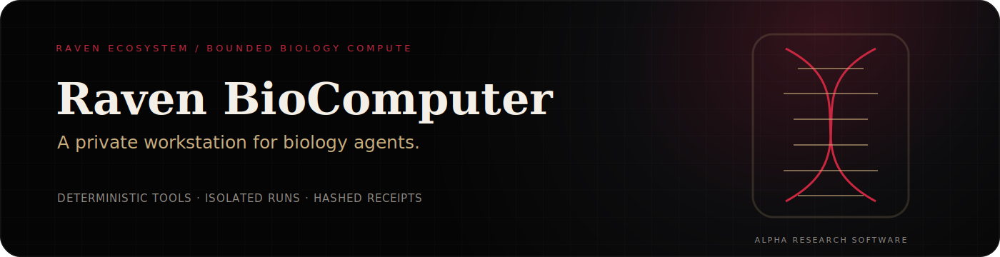

<p align="center">
  
</p>

<p align="center">
  <a href="https://simpliibarrii-crypto.github.io/project.html?project=raven-biocomputer"></a>
  <a href="https://simpliibarrii-crypto.github.io/research.html"></a>
  <a href="LICENSE"></a>
</p>

> **Raven BioComputer** gives biology agents an isolated run workspace, a registered deterministic tool, a policy decision, and an evidence-linked artifact receipt instead of unrestricted computer access.

**Maturity:** Alpha research software. Not a medical device, clinical decision system, biosafety platform, or autonomous wet-lab controller.

## What works

- Private run directory for every task
- Deterministic sequence statistics, reverse complement, motif search, translation, and FASTA summaries
- Dry-lab, human-review, and blocked policy classes
- SHA-256 input and output artifact receipts
- Raven Evidence Graph and JSpace Chain envelopes
- Home for AI, Hermes Edge, and OpenClinical bridge records
- CLI, FastAPI, MCP server, Docker worker, and Gradio demonstration
- Zero cloud dependency for the core execution path

## Execution contract


## Quick start

```bash
git clone https://github.com/simpliibarrii-crypto/simpliibarrii-crypto-raven-biocomputer.git
cd simpliibarrii-crypto-raven-biocomputer
python -m venv .venv
source .venv/bin/activate
pip install -e ".[dev]"
pytest
```

Run a bounded task:

```bash
raven-biocomputer run sequence_stats \
  --task "Inspect this demonstration sequence" \
  --payload '{"sequence":"ATGGCCATTGTAATGGGCCGCTGA"}'
```

A successful run writes:

```text
runs/<run-id>/
├── input.json
├── result.json
└── receipt.json
```

Launch the branded Gradio workstation:

```bash
python app.py
```

## Ecosystem role

| System | BioComputer relationship |
|---|---|
| [Raven AI](https://github.com/simpliibarrii-crypto/raven-ai) | Receives bounded computational results with evidence and artifact references |
| JSpace Chain | Gates tasks and records structured policy reflection |
| [Home for AI](https://github.com/simpliibarrii-crypto/home-for-ai) | Displays run state, artifacts, replay information, and receipts |
| [Hermes Edge](https://github.com/simpliibarrii-crypto/hermes-edge) | Routes deterministic local tools before larger models or remote calls |
| [OpenClinical AI](https://github.com/simpliibarrii-crypto/openclinical-ai) | Receives only reviewed translational outputs, never automatic clinical decisions |

## Safety boundary

Contributions must remain dry-lab and deterministic. Do not submit patient data, autonomous wet-lab actions, genome-editing execution workflows, pathogen-engineering instructions, or attempts to bypass policy gates.

## Contributing

Start with **[deterministic biology fixtures and artifact receipts](https://github.com/simpliibarrii-crypto/simpliibarrii-crypto-raven-biocomputer/issues/2)**. Useful contributions include test fixtures, reproducible containers, receipt validation, MCP interoperability, and ordinary bioinformatics utilities.

## Public proof

- [Interactive browser case study](https://simpliibarrii-crypto.github.io/project.html?project=raven-biocomputer)
- [Research archive](https://simpliibarrii-crypto.github.io/research.html)
- [Complete portfolio](https://simpliibarrii-crypto.github.io/)

## License

Apache-2.0. See [LICENSE](LICENSE).
