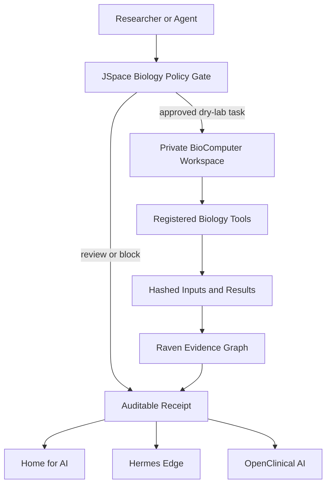

<p align="center">
  <strong><a href="https://barry-ai-public.simpliibarrii.chatgpt.site">Explore the complete AI research & projects portfolio →</a></strong>
</p>

# 🧬 Raven BioComputer

**Give every biology agent a private, auditable computer.**

Raven BioComputer is an open-source, local-first workstation layer for biology AI. It takes the useful core of agent-computer projects, an isolated workspace with files, tools, and persistent receipts, then reshapes it for reproducible science instead of generic desktop automation.

An agent does not receive unrestricted access to your machine. It receives a bounded run workspace, a registered biology tool, a JSpace policy decision, and a Raven Evidence Graph receipt.

> Alpha research software. Not a medical device, clinical decision system, biosafety platform, or autonomous wet-lab controller.

## Why it belongs in the Raven stack

| Ecosystem surface | BioComputer role |
|---|---|
| Raven AI | Executes bounded biology tasks and returns evidence-linked results |
| JSpace Chain | Gates each task and records structured policy reflection |
| Home for AI | Displays local run status, artifacts, replay state, and audit receipts |
| Hermes Edge | Routes deterministic tools locally before larger models or cloud calls |
| OpenClinical AI | Receives only reviewed, bounded translational outputs, never automatic clinical decisions |

## What works in v0.1

- Private directory per task
- Deterministic tools for sequence statistics, reverse complement, motif search, translation, and FASTA summaries
- Dry-lab, human-review, and blocked policy classes
- SHA-256 input and output artifact receipts
- Raven Evidence Graph and JSpace Chain envelopes
- Home for AI, Hermes Edge, and OpenClinical bridge contracts
- CLI, FastAPI, MCP server, Docker worker, and Gradio Space demo
- Zero cloud dependency for the core execution path

## Quick start

```bash
git clone https://github.com/simpliibarrii-crypto/simpliibarrii-crypto-raven-biocomputer.git
cd simpliibarrii-crypto-raven-biocomputer
python -m venv .venv
source .venv/bin/activate
pip install -e ".[dev]"
pytest
```

Run a bounded task:

```bash
raven-biocomputer run sequence_stats \
  --task "Inspect this demonstration sequence" \
  --payload '{"sequence":"ATGGCCATTGTAATGGGCCGCTGA"}'
```

The output includes a `raven.biocomputer.run.v1` receipt and writes:

```text
runs/<run-id>/
├── input.json
├── result.json
└── receipt.json
```

## Optional surfaces

### Gradio / Hugging Face Space

```bash
pip install -e ".[space]"
python app.py
```

### FastAPI

```bash
pip install -e ".[api]"
raven-biocomputer serve --host 0.0.0.0 --port 8042
```

### MCP

```bash
pip install -e ".[mcp]"
raven-biocomputer-mcp
```

### Hardened container worker

```bash
docker compose run --rm worker
```

The worker profile runs as non-root, disables networking, drops Linux capabilities, and uses a read-only root filesystem with a writable run mount.

## Architecture



See [Architecture](docs/ARCHITECTURE.md), [Integration](docs/INTEGRATION.md), [Security](docs/SECURITY.md), and [Roadmap](docs/ROADMAP.md).

## Scientific stance

Raven BioComputer is intentionally conservative. It is built to make ordinary computational biology tasks easier to reproduce and harder to falsify. Patient-specific decisions, raw PHI, autonomous wet-lab actions, genome editing, and pathogen engineering stop at a human-review gate.

## License

Apache-2.0. See [LICENSE](LICENSE).
