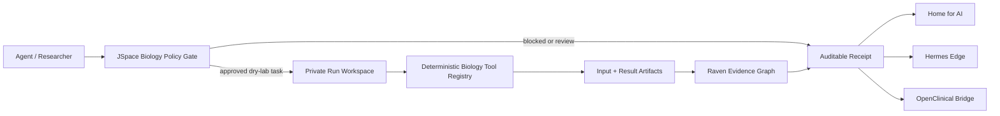

# Architecture

Raven BioComputer gives each agent task a bounded biology workspace rather than direct access to the host computer.

## Control planes

1. **Policy plane**: classifies requests as dry-lab, human-review, or blocked.
2. **Execution plane**: runs only registered deterministic tools. No arbitrary shell is exposed.
3. **Workspace plane**: creates one directory per run and prevents path traversal.
4. **Evidence plane**: hashes inputs and outputs and emits a portable receipt.
5. **Integration plane**: writes contracts for Raven, JSpace Chain, Home for AI, Hermes Edge, and OpenClinical AI.

## Deliberate limits in v0.1

- No autonomous wet-lab control.
- No raw patient data or clinical decision support.
- No arbitrary shell, package installation, secrets access, or network browsing.
- No claim that a directory sandbox is equivalent to a hardware-backed VM.

The container profile tightens isolation with a non-root user, dropped Linux capabilities, `no-new-privileges`, and a network-disabled worker profile. A future runtime can swap the workspace adapter for Firecracker, Kata Containers, gVisor, E2B, or another verified isolation backend without changing the run-receipt contract.
